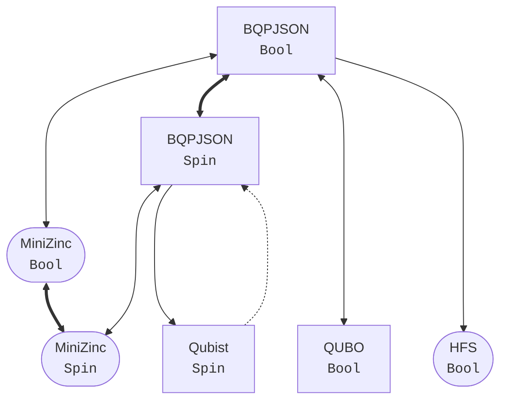

# BQPIO.jl

<div align="center">
    <a href="/docs/src/assets/">
        
    </a>
    <br>
    <a href="/actions/workflows/ci.yml">
        
    </a>
    <br>
    <i>Binary Quadratic Program I/O in Julia</i>
</div>

## Introduction
The `BQPIO.jl` package implements codecs for BQP (*Binary Quadratic Programs*) instances.
Its purpose is to provide fast and reliable conversion between common formats used to represent such problems.
This allows for rapid leverage of many emergent computing architectures whose job is to solve this kind of optimization problem.

## Getting Started

### Installation
```julia
julia> import Pkg; Pkg.add("BQPIO")

julia> using BQPIO
```

### Basic Usage
```julia
julia> model = read("problem.json", BQPJSON)

julia> model = convert(QUBO, model)

julia> write("problem.qubo", model)
```

## Supported Formats
It is possible to read file formats marked with `r` and write in those stamped with a `w`.

### [BQPJSON](/docs/models/BQPJSON.md) `rw`
The [bqpjson](https://bqpjson.readthedocs.io) format was designed by people at LANL-ANSI to represent Binary Quadratic Programs in a platform-independet fashion.
This is accomplished by using `.json` files validated using a well-defined [JSON Schema](/src/models/bqpjson.schema.json).

### [QUBO](/docs/models/QUBO.md) `rw`
The QUBO specification appears as the input format in many of D-Wave's applications.
A brief explanation about it can be found in [qbsolv](https://github.com/arcondello/qbsolv#qbsolv-qubo-input-file-format)'s repository README. 

### [Qubist](/docs/models/Qubist.md) `rw`
This is the simplest of all current supported formats.

### [MiniZinc](/docs/models/MiniZinc.md) `w`
[MiniZinc](https://www.minizinc.org) is a constraint modelling language that can be used as input for many solvers.

### [HFS](/docs/models/HFS.md) `w`
HFS is a very low-level mapping of weights to D-Wave's chimera graph.

### Conversion Flowchart
**Bold arrows** indicate that a bijective (modulo rounding erros) conversion is available.
**Regular arrows** indicate that some non-critical information might get lost in the process, such as problem metadata.
**Dashed arrows** tell that even though a format conversion exists, important information such as scale and offset factors will be neglected.



## Backend
The `AbstractBQPModel{D}` abstract type is defined, where `D <: VariableDomain`.
Available variable domains are `BoolDomain` and `SpinDomain`, respectively, $x \in \lbrace 0, 1 \rbrace$ and $s \in \lbrace -1, 1 \rbrace$.
Conversion between domains follows the identity $$s = 2x - 1$$

**BQPIO.jl** also exports the ``StandardBQPModel{S, U, T, D} <: AbstractBQPModel{D}`` type, designed to work as a powerful standard backend for all other models.
Here, `S <: Any` plays the role of variable indexing type and usually defaults to `Int`.
It is followed by `U <: Integer`, used to store sampled states of type `Vector{U}`.

When `D <: SpinDomain`, it is necessary that `U <: Signed`.
`T <: Real` is the type used to represent all coefficients.
It is also the choice for the energy values corresponding to each solution.
It's commonly set as `Float64`.

This package follows **bqpjson**'s mathematical formulation, given by

$$ f(\vec{x}) = \alpha \left[{ \sum_{i < j} q_{i, j}\,x_{i}\,x_{j} +\sum_{i} l_{i}\,x_{i} + \beta }\right] $$

where $\alpha$ is a scaling factor, $\beta$ a constant offset, $l_{i}\,x_{i}$ are the linear terms and $q_{i, j}\,x_{i}\,x_{j}$ the quadratic ones.

### [JuMP](https://jump.dev) Integration

One of the main ideas was to make JuMP / MathOptInterface integration easy and, in fact, the implemented backend does a lot of the the data crunching.
When `S` is set to `MOI.VariableIndex` and `T` matches `Optimzer{T}`, we can say that most of the hard work is done.

<div align="center">
    <h2>PSR Quantum Optimization Toolchain</h2>
    <a href="https://github.com/psrenergy/ToQUBO.jl">
        
    </a>
    <a href="https://github.com/psrenergy/Anneal.jl">
        
    </a>
    <a href="https://github.com/psrenergy/BQPIO.jl">
        
    </a>
</div>