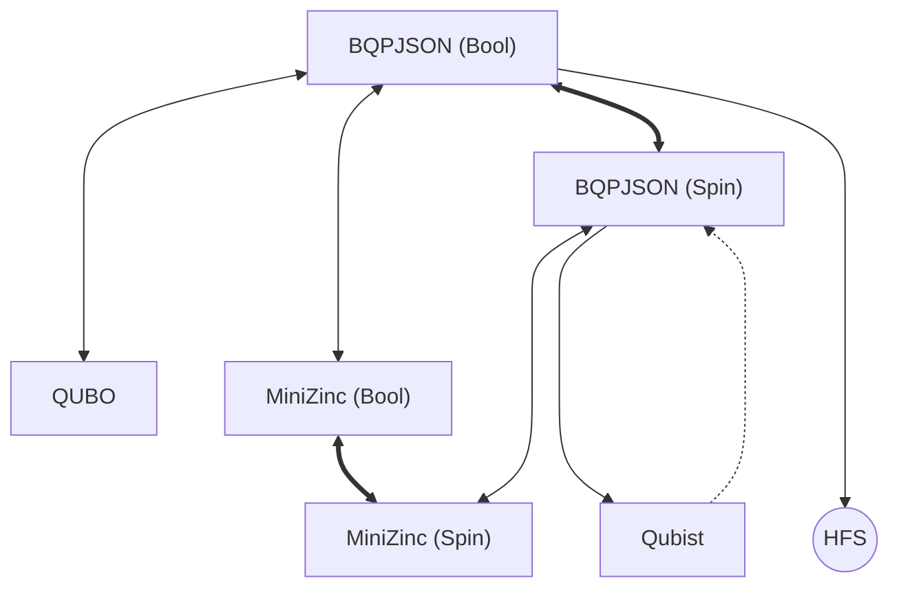

# BQPIO.jl
Binary Quadratic Program's I/O in Julia

This package exports the `AbstractBQPModel{D}` abstract type where `D <: VariableDomain`.
Available variable domains are `BoolDomain` and `SpinDomain`, respectively, $x \in \{0, 1\}$ and $s \in \{-1, 1\}$.

## Supported Formats
It is possible to read and write files in all available formats, listed below.

### BQPJSON
The [bqpjson](https://bqpjson.readthedocs.io) format was designed by people at LANL-ANSI to represent Binary Quadratic Programs in a platform-independet fashion.
This is accomplished by using `.json` files validated using a well-defined [JSON Schema](/src/models/bqpjson.schema.json).

### QUBO

### Qubist

### MiniZinc

### HFS

### Conversion Flowchart
**Bold arrows** indicate that a bijective (modulo rounding erros) conversion is available.
**Regular arrows** indicate that some non-critical information might get lost in the process, such as problem metadata.
**Dashed arrows** tell that even though a format conversion exists, important information such as scale and offset factors will be neglected.

**Square nodes** represent formats with support for reading and writing, while **Round nodes** indicate write-only behaviour.