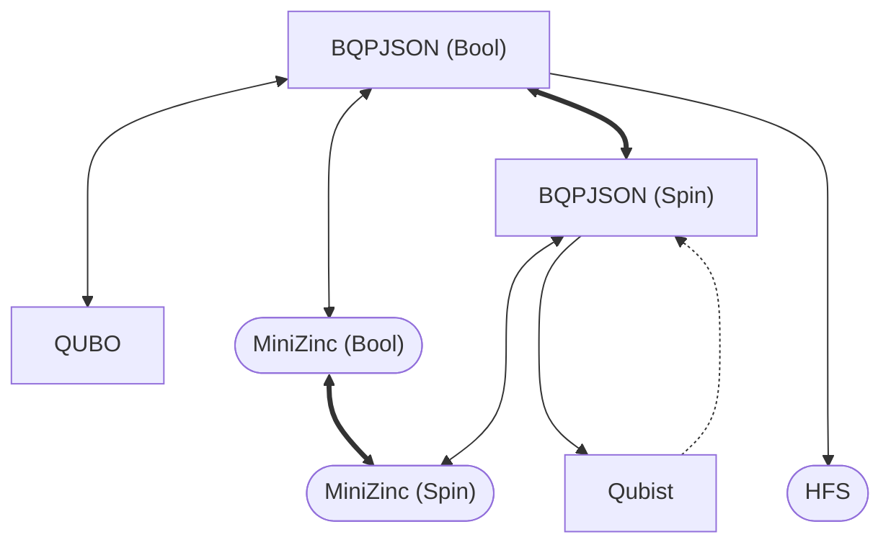

# BQPIO.jl

    
     
    

Binary Quadratic Program's I/O in Julia

This package exports the `AbstractBQPModel{D}` abstract type where `D <: VariableDomain`.
Available variable domains are `BoolDomain` and `SpinDomain`, respectively, $x \in \\\{ 0, 1 \\\}$ and $s \in \\\{ -1, 1 \\\}$.

Conversion between domains follows the identity
$$ s = 2x - 1 $$

## Supported Formats
It is possible to read and write files in all available formats, listed below.

### [BQPJSON](/docs/models/BQPJSON.md)
The [bqpjson](https://bqpjson.readthedocs.io) format was designed by people at LANL-ANSI to represent Binary Quadratic Programs in a platform-independet fashion.
This is accomplished by using `.json` files validated using a well-defined [JSON Schema](/src/models/bqpjson.schema.json).

### [QUBO](/docs/models/QUBO.md)
The QUBO specification appears as the input format in many of D-Wave's applications.
A brief explanation about it can be found in [qbsolv](https://github.com/arcondello/qbsolv#qbsolv-qubo-input-file-format)'s repository README. 

### [Qubist](/docs/models/Qubist.md)
This is the simplest of all current supported formats.

### [MiniZinc](/docs/models/MiniZinc.md)
[MiniZinc](https://www.minizinc.org) is a constraint modelling language that can be used as input for many solvers.

### [HFS](/docs/models/HFS.md)
HFS is a very low-level mapping of weights to D-Wave's chimera graph.

### Conversion Flowchart
**Bold arrows** indicate that a bijective (modulo rounding erros) conversion is available.
**Regular arrows** indicate that some non-critical information might get lost in the process, such as problem metadata.
**Dashed arrows** tell that even though a format conversion exists, important information such as scale and offset factors will be neglected.

**Rectangular nodes** represent formats with support for reading and writing, while **Rounded nodes** indicate write-only behaviour.

## Backend
**BQPIO.jl** also exports the 

``StandardBQPModel{S, U, T, D} <: AbstractBQPModel{D}``

type, designed to work as a powerful standard backend for all other models.
Here, `S <: Any` plays the role of variable indexing type and usually defaults to `Int`.
It is followed by `U <: Integer`, used to store sampled states of type `Vector{U}`.
When `D <: SpinDomain`, it is necessary that `U <: Signed`.

`T <: Real` is the type used to represent all coefficients.
It is also the choice for the energy values corresponding to each solution.
It's commonly set as `Float64`.

### [JuMP](https://jump.dev) Integration

One of the main ideas was to make JuMP / MathOptInterface integration easy and, in fact, the implemented backend does a lot of the the data crunching.
When `S` is set to `MOI.VariableIndex` and `T` matches `Optimzer{T}`, we can say that most of the hard work is done.