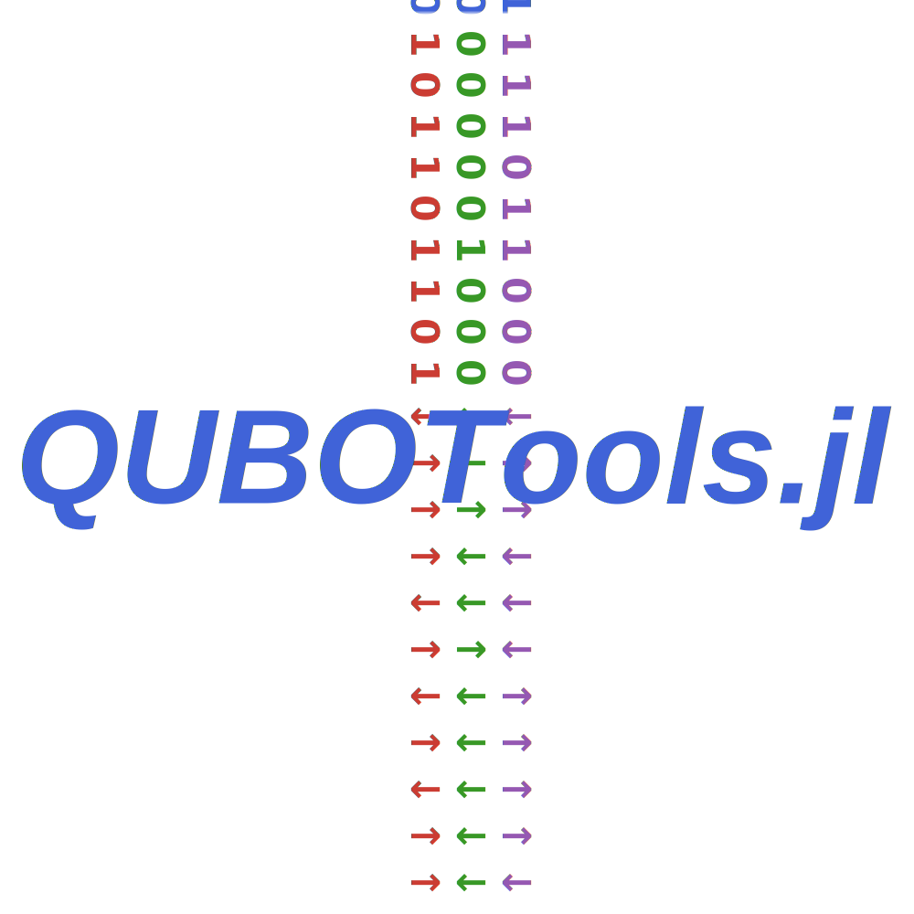

# QUBOTools.jl's Assets

## [Logo](@id logo)

QUBOTools's logo depicts the conversion between binary data and spin states.
This represents the available codecs for manipulating _Ising_ and _QUBO_ models.

## Colors

The colors were chosen according to  *Julia's Reference for logo graphics*[¹](#1).
Text color matches the innermost shape and renders fairly well in both light and dark background themes.

## Typography
*Arial*(#2) Font was used.
It was chosen to represent the simplicity of this package.

<a href="#1">¹</a> [github.com/JuliaLang/julia-logo-graphics](https://github.com/JuliaLang/julia-logo-graphics/)